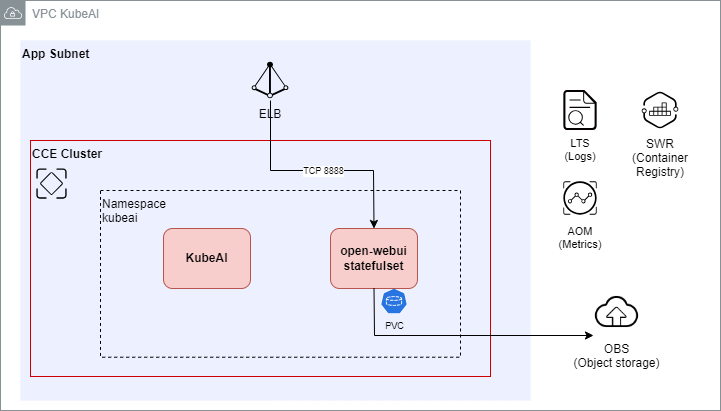
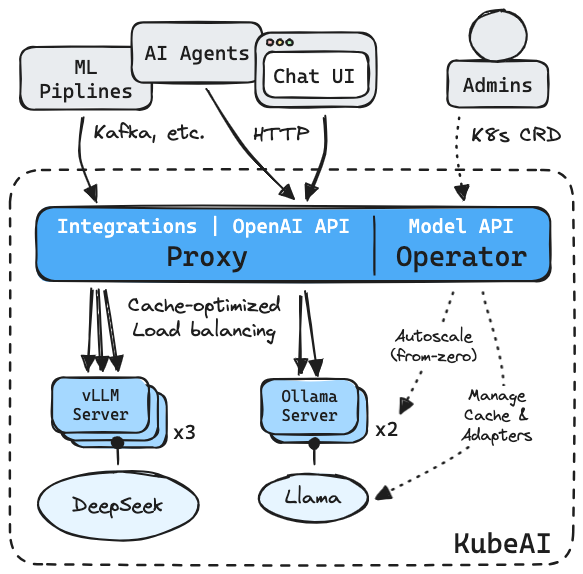
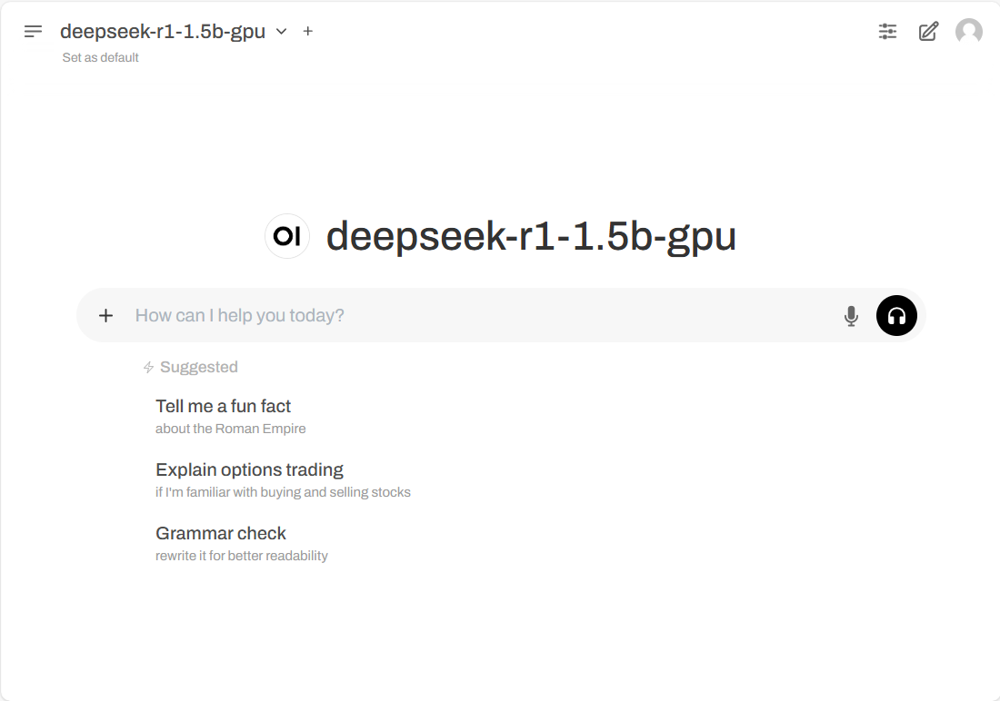

# AI Inferencing Operator on Huawei Cloud Managed Kubernetes Service (CCE)
Deploy and scale machine learning models on Kubernetes. Built for LLMs, embeddings, and speech-to-text.
For more information about the open-source project, refer https://github.com/substratusai/kubeai





## Overview
KubeAI inferece operator allows you to run, manage and host LLMs easily on Kubernetes clusters on CPU or GPU(Nvidia, AMD) and even NPU and TPUs.
In this example, we will use KubeAI powered by Huawei Cloud CCE with a GPU node.

This is good for: 
🚀 LLM Inferencing - Operate vLLM and Ollama servers\
🎙️ Speech Processing - Transcribe audio with FasterWhisper\
🔢 Vector Embeddings - Generate embeddings with Infinity\
⚡️ Intelligent Scaling - Scale from zero to meet demand\
📊 Optimized Routing - Dramatically improves performance at scale)\
💾 Model Caching - Automates downloading & mounting (Huawei Cloud SFS, etc.)\
🧩 Dynamic Adapters - Orchestrates LoRA adapters across replicas\
📨 Event Streaming - Integrates with Kafka, PubSub, and more\
<br />
🔗 OpenAI Compatible - Works with OpenAI client libraries\
🛠️ Zero Dependencies - Does not require Istio, Knative, etc.\
🖥 Hardware Flexible - Runs on CPU, GPU, or TPU

## Pre-requisite
Before running this, ensure you have the following,
1. Huawei Cloud account
2. Kubectl configured (Either via a cloud VM, or on your local machine). Follow this for setup: https://support.huaweicloud.com/intl/en-us/usermanual-cce/cce_10_0107.html
3. Helm installed

### To deploy

1. Create a namespace, in this example "kubeai"
   ```kubectl create namespace kubeai```
2. Create pv and pvc for open-webui
   ```kubectl create -f pv-pvc.yaml -n kubeai```
3. Add KubeAI repo, SKIP this if you are installing offline.
   ```helm repo add kubeai https://www.kubeai.org```
   ```helm repo update```
4. Deploy kubeai with custom-values.yaml (INTERNET CONNECTED)
   ```helm upgrade --install kubeai kubeai/kubeai -f custom-values.yaml -n kubeai --wait --timeout 15m```
5. Deploy kubeai with custom-values.yaml (OFFLINE)
   ```helm upgrade --install kubeai kubeai-0.XX.0.tgz -f custom-values.yaml  -n kubeai --wait --timeout 15m```
   >Note: Get the tgz from kubeai release and change the version number to reflect the version you wish to deploy.
6. Deploy models with kubeai-models.yaml
   ```helm upgrade --install kubeai-models kubeai/models -f ./kubeai-models.yaml -n kubeai --wait --timeout 15m```
7. Create a Load Balancer service to access open-webui
   ```kubectl create -f elb-svc.yaml -n kubeai```
8. Visit the public ip shown at elb-svc-openwebui at CCE > Services & ingress.
<br />
      
